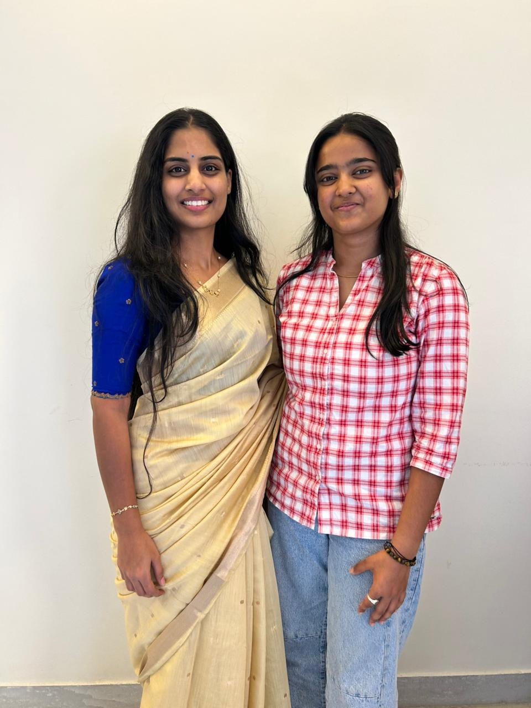
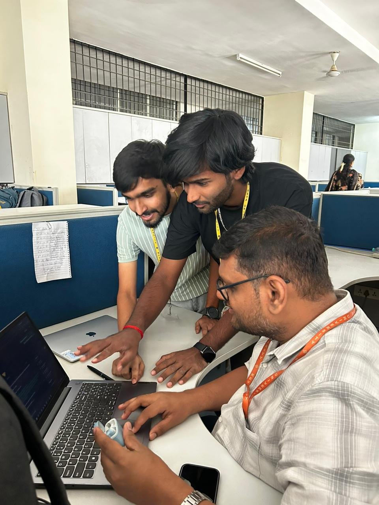
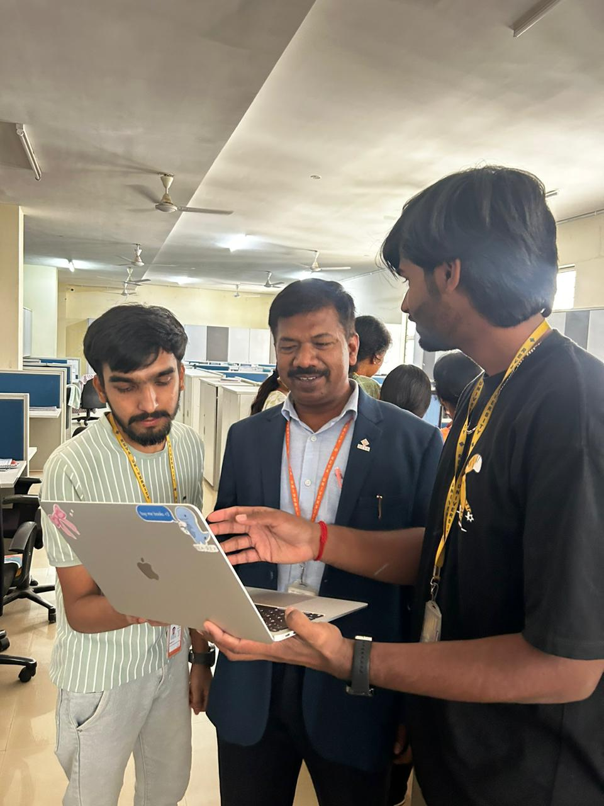
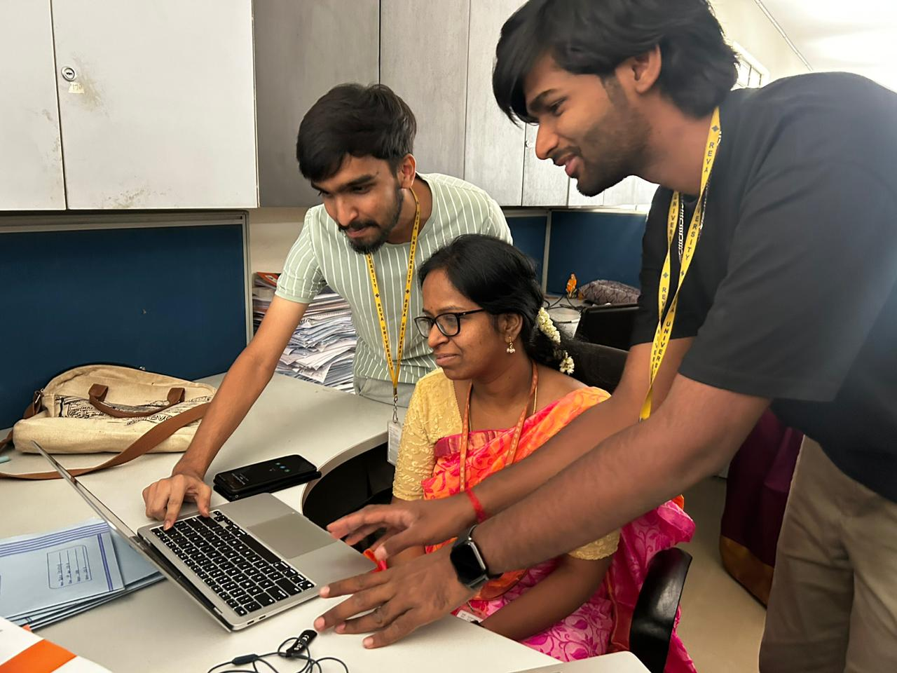
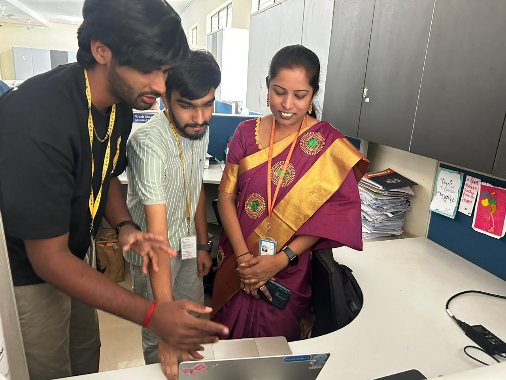

# Customer Interview & Validation

## 🎥 Interview Video

Watch our customer interaction and validation video here:

https://drive.google.com/drive/folders/13t9bs2GQe7SGtWBNcdBtPpqnf8r9kCRu

## 📌 Summary

We interacted with industry professionals and users to understand real-world SEO challenges.

### Participants:
- Harish Thimmegowda (Senior Director – Client Services, Availity)
- Rekha Kosuru (Team Lead & Hiring Manager, Clean Harbors)

### Key Insights:
- Users lack knowledge of SEO & AEO
- Existing tools are complex
- Manual optimization is time-consuming
- Strong need for automation

## 📸 Interaction Photos

